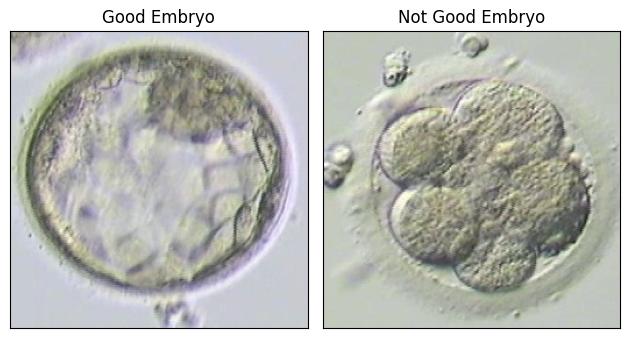

## Overview
In this project, we aimed to classify embryos based on their microscopic images. We used Xception model with pretrained weights on Imagenet. This project is based on the Xception architecture [in this repository](https://github.com/tstandley/Xception-PyTorch).

Here we can see examples of one good and one not embryos:



## Installation
Install the required Python packages buy running the following line:
```bash
pip install -r requirements.txt
```

## Files
The dataset is structured in `train` and `test` folders with their corresponding csv files containing extra information in the `data` directory.
The `checkpoints` folder contains the weights of the model on Imagenet (`xception-43020ad28.pth`) and the weights of the fine-tuned model on the embryo images (`ckpt.pth`).
